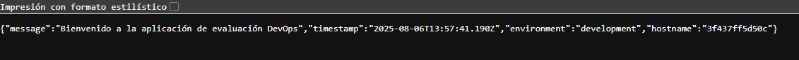

# ArquitecturaSFV-P1

# Evaluación Práctica - Ingeniería de Software V

## Información del Estudiante
- **Nombre: Leidy Daniela Londoño Candelo**
- **Código: A00392917**
- **Fecha: 6/08/2025**

## Resumen de la Solución
Se desarrolló un entorno de contenerización utilizando Docker para una aplicación Node.js proporcionada. Se creó un `Dockerfile`, se construyó la imagen y se ejecutó el contenedor para validar que la aplicación responde correctamente desde un navegador o mediante `curl`.

## Dockerfile
Diseñe el `Dockerfile` investigando las cosas que deberia contener para su creación el cual fue diseñado para contenerizar la aplicación `app.js` desarrollada con Express. Las decisiones técnicas incluyeron:

- Uso de la imagen oficial `node:22` como base.
- Definición del directorio de trabajo en `/usr/src/app`.
- Copia de archivos `package.json` y `package-lock.json`.
- Instalación de dependencias con `npm install`.
- Exposición del puerto 3000.
- Uso del comando `CMD ["node", "app.js"]` para iniciar el servidor.

## Script de Automatización
[Describe cómo funciona tu script y las funcionalidades implementadas]

## Principios DevOps Aplicados
1. [Principio 1]
2. [Principio 2]
3. [Principio 3]

## Captura de Pantalla

## Mejoras Futuras
[Describe al menos 3 mejoras que podrían implementarse en el futuro]

## Instrucciones para Ejecutar
[Instrucciones paso a paso para ejecutar tu solución]
